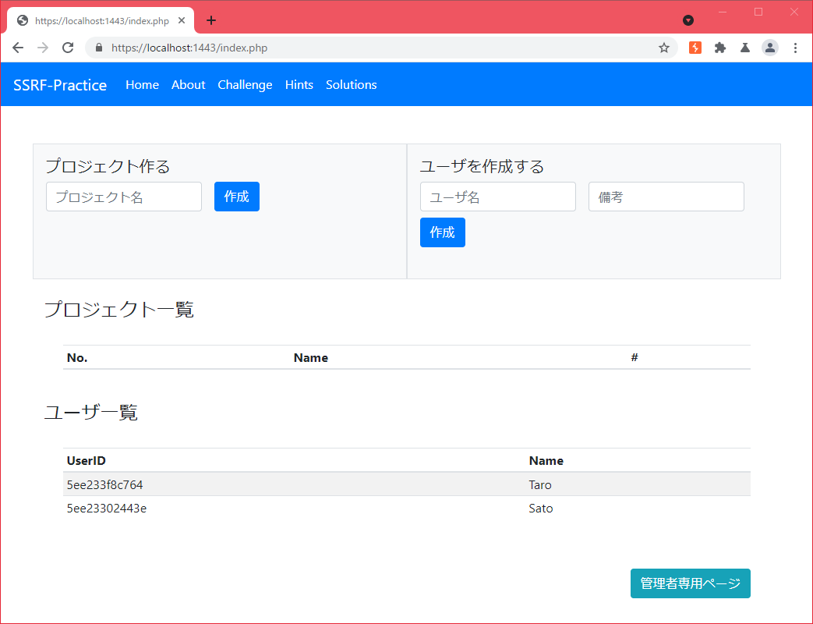

# SSRF-Practice
## 概要
本プログラムは、Server Side Request Forgery(以下、SSRF)の脆弱性を社内でも検証できるように用意したものです。
SSRFの脆弱性を悪用し、隠されたメッセージ(`FLAG_****`)を見つけてください。  
見つけたFLAGはChallengeのページからFLAGの値を送信してください。  
正しいFLAGを送信することができた場合はCompletionのリストにチェックが付きます。  

本プログラムについての説明や環境構成などは、プログラム起動後のAboutページに記載しています。  

発表用資料  
https://www.slideshare.net/ssuser12fe9c/ssrf-248482162

## スクリーンショット

## 必要環境
* Docker
* docker-compose

## 諸注意
本プログラムは意図的に脆弱性を作りこんでいます。  
検証後はアプリを停止してください。  

## 動かし方
> $ git clone https://github.com/wild0ni0n/ssrf-practice.git  
> $ cd ssrf-practice  
> $ docker-compose up -d  

## 止め方
> $ docker-compose stop

コンテナの削除も行う場合
> $ docker-compose down

## アクセス方法
ブラウザで以下のURLにアクセスしてください。  
> https://localhost:1443 

リクエスト記録用の攻撃者サーバも用意してます。FLAG取得の過程で使用します。  
> https://localhost:8888 

docker環境をVMで用意しておりNAT設定している場合は、VMのネットワーク設定に以下の設定を入れてください。  
[host]127.0.0.1:1443 <=>[guest]0.0.0.0:1443
[host]127.0.0.1:8888 <=>[guest]0.0.0.0:8888

# 参考情報
* [SSRF(Server Side Request Forgery)徹底入門](https://blog.tokumaru.org/2018/12/introduction-to-ssrf-server-side-request-forgery.html)
* [SSRF基礎](https://speakerdeck.com/hasegawayosuke/ssrfji-chu)
* [Server-side request forgery (SSRF)](https://portswigger.net/web-security/ssrf)
* [cloud-service-metadata-api-list.md](https://gist.github.com/mrtc0/60ca6ba0fdfb4be0ba499c65932ab42e)